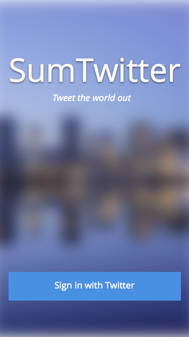
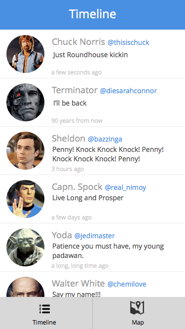
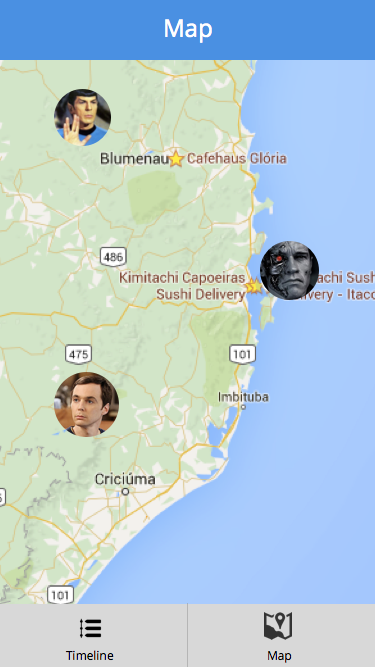

# SumOne Programming Challenge - Mobile Developer

Seu objetivo nesta challenge é construir um pequeno aplicativo que traga
informações do Twitter.

## Especificações

O aplicativo possui três telas:

* Login - Onde o usuário faz login no seu twitter
* ListView - Onde são exibidos os últimos tweets da timeline dele
* MapView - Onde são localizados em um mapa os últimos tweets da timeline dele

**Serão avaliados:** apenas a organização do código, uso
das ferramentas disponíveis, conhecimento e domínio sobre as linguagens e a
capacidade de implementação das especificações

## Telas de referência

**As telas a seguir são apenas ilustrativas, para dar uma ideia de como poderia
ser uma implementação**

## Requisitos técnicos

* Você pode desenvolver tanto em Android (Java) quanto iOS (Obj.C/Swift).
* É permitido o uso de frameworks e bibliotecas externos, desde que dentro de um
  sistema de gerenciamento de pacotes.
* O código deve ser claro, preferencialmente documentado.
* A arquitetura e design do sistema devem ser documentadas em um arquivo README
  (brevemente, por favor).
* Deve ser usado GIT para versionamento.

## Bônus!

Testes são muito bem vindos, sobrando qualquer tempo, faça-os e ganhe uma
pontuação extra!

Se você tiver ainda mais tempo e quiser arriscar, faça uma nova tela
ProfileView, acessível tanto pelo mapa quanto pela timeline para ver o perfil
do usuário que tweetou!

## Envio

Envie o seu código pronto através do e-mail, com um link para um repositório no
GitHub (é grátis!). Por favor, inclua instruções de como fazer o build em seu
README caso ele precise de algo especial.

### Disclaimer

Completar a challenge não implica em nenhum vínculo nem obrigação da SumOne
com você. Todo o código criado será descartado. Este challenge usa elementos
reais de necessidades da SumOne apenas como uma maneira de avaliarmos sua
aptidão para o cargo.

### Final notes

Valorizamos **muito** a capacidade de nos surpreender!

Boa sorte :)
